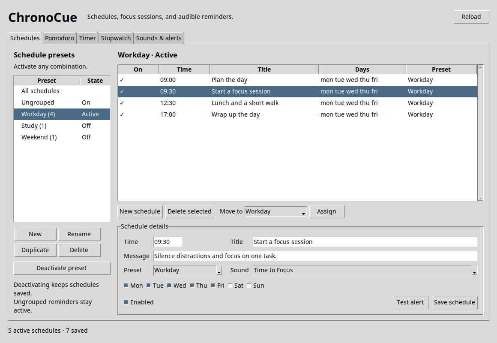
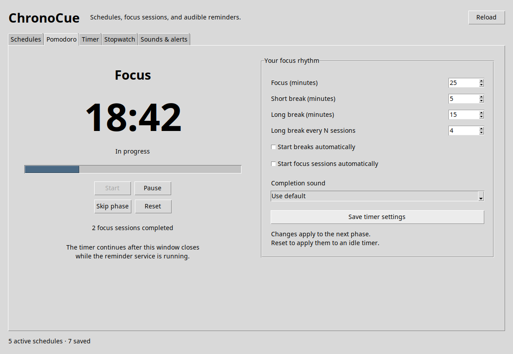
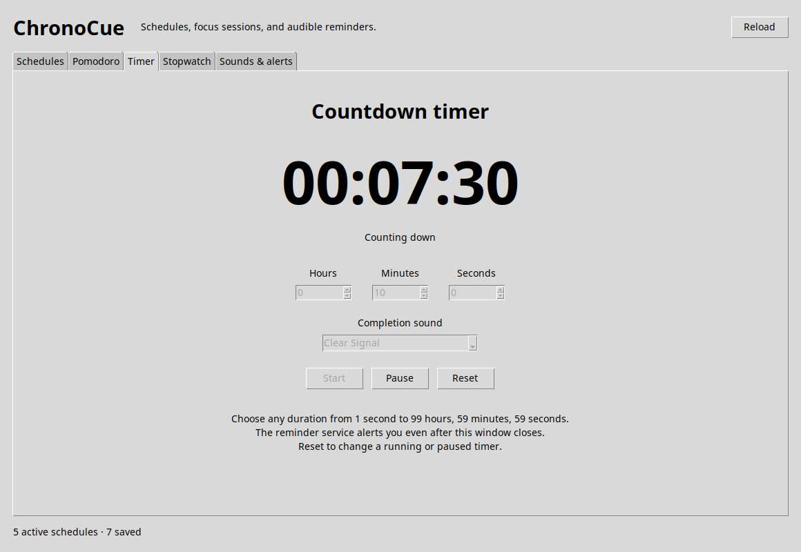
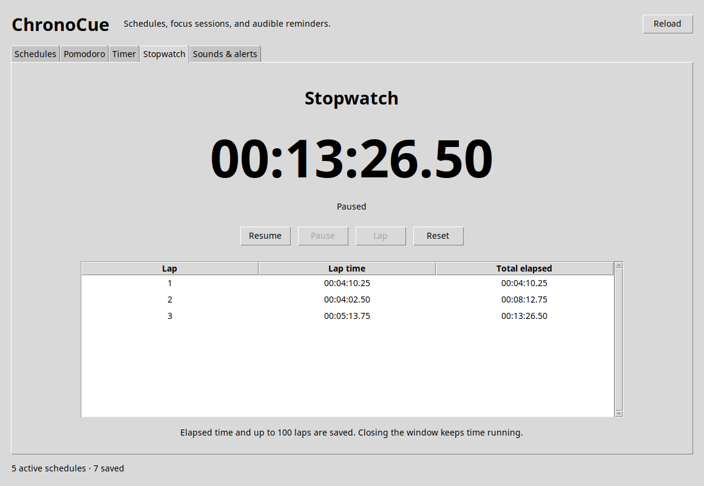
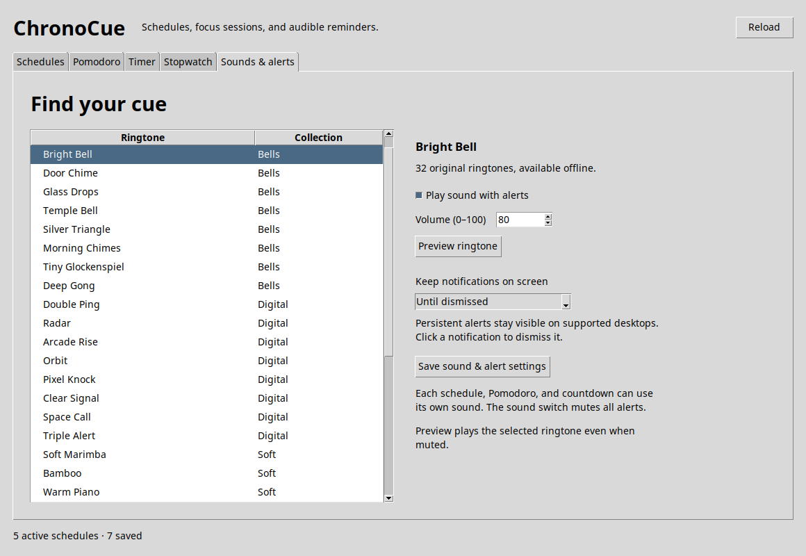

# ChronoCue

A small Linux desktop reminder app with schedule presets, Pomodoro, a countdown timer,
a stopwatch, and 32 selectable alert sounds. Built for lightweight desktops such as i3 using
Python's standard library, Tk, desktop notifications, and a user systemd service.

Version **1.2.0** adds **Timer** and **Stopwatch** tabs, persistent notifications,
and prompt audio playback. Existing schedules continue to work without manual migration.

## Preview

Group reminders into presets and activate them whenever you need them.



<details>
<summary>See Pomodoro, timer, stopwatch, and alert settings</summary>

### Pomodoro

Follow a focus and break rhythm with progress tracking and configurable durations.



### Countdown timer

Set a duration, pause or resume, and receive a completion alert with your chosen sound.



### Stopwatch

Track elapsed time and save individual laps, even across closing and reopening the editor.



### Sounds and persistent alerts

Choose from 32 offline ringtones and keep notifications visible until dismissed.



</details>

*Screenshots show ChronoCue 1.2.0 with sample data. Appearance may vary by desktop theme.*

## Install or update

Requirements: Linux, Python 3.10+, Tk, `notify-send`, a desktop notification
service, a running systemd user session, and one of `paplay`, `pw-play`, or `aplay`.

On Ubuntu/Debian:

```bash
sudo apt install python3 python3-tk libnotify-bin pulseaudio-utils
```

If your desktop does not already provide a notification service, install one
such as dunst:

```bash
sudo apt install dunst
notify-send "Test" "Notifications work"
```

From the repository root, in your desktop session:

```bash
./scripts/install.sh
~/.local/bin/chronocue-ui
```

Do not run the installer with `sudo`. It checks dependencies and systemd access,
installs the app, and enables and restarts `chronocue.service`. Run it again after
updating the source to upgrade. Your schedules and timer state are preserved.
Add `~/.local/bin` to your `PATH` to use the commands without their full paths.

Default locations:

```text
~/.local/bin/chronocue-daemon
~/.local/bin/chronocue-ui
~/.local/share/chronocue/
~/.config/chronocue/schedule.json
~/.config/systemd/user/chronocue.service
~/.local/state/chronocue/       # delivery history and clock states
~/.cache/chronocue/            # generated ringtone WAV files
```

The installer supports absolute `XDG_DATA_HOME`, `XDG_CONFIG_HOME`,
`XDG_STATE_HOME`, and `XDG_CACHE_HOME` paths. Launchers remember the chosen config,
state, and cache locations so the editor and service share the same timer.

## Schedule presets

Presets are named groups you can activate or deactivate whenever you need them.
Multiple groups can be active together, for example **Work**, **Exercise**, and
**Study**.

1. In **Schedules**, click **New** under Schedule presets and name the group.
2. Add schedules to it using the **Preset** field. To group existing schedules,
   select one or more rows, choose a group next to **Move to**, and click **Assign**.
3. Select the preset in the sidebar and click **Activate preset** to summon it.
4. Click **Deactivate preset** to stop its reminders while keeping everything saved.

New and duplicated presets start inactive. Individual schedules retain their
own Enabled setting. Ungrouped schedules always follow their own Enabled setting,
independently of presets. You can rename or duplicate a group. Deleting a preset
asks for confirmation and removes its schedules; deactivate it to keep them.

The sidebar also filters the table. The **On** column shows whether a schedule
is effective, combining its own Enabled setting with its preset's state.
Activating a preset follows the normal timing grace period; it does not replay
old or already-delivered reminders.

Edits are saved atomically. If another editor or process changes the file, stale
saves are rejected with Reload instructions. Opening the editor does not rewrite
an existing configuration.

## Pomodoro clock

The **Pomodoro** tab includes Start, Pause/Resume, Skip phase, and Reset controls,
a countdown, phase progress, and a count of completed focus sessions.

Defaults are 25 minutes of focus, a 5-minute short break, and a 15-minute long
break after every four completed focus sessions. Durations are configurable from
1 to 240 minutes; the long-break interval can be 1 to 12 focus sessions.

Each completed phase produces a desktop alert and its chosen sound. Breaks and
focus sessions wait for you to press Start by default. Enable either automatic
start option to continue into that phase automatically. Skipping a focus phase
does not count it as completed.

The reminder daemon runs the timer, so it continues after the editor closes and
survives ordinary daemon restarts. The editor requires the daemon to be running
before Start; use `systemctl --user start chronocue` if necessary. When running
from source, start the daemon with the same `--config` path as the editor.

Changing settings affects the next phase, leaving a running or paused phase's
remaining time intact. Reset starts a new cycle with the saved settings. After
suspend or downtime, only the current overdue phase completes; automatic mode
starts a fresh next phase when the daemon resumes. It does not fast-forward
through many missed focus sessions. Timer deadlines use the system clock, so
manual clock changes affect the remaining time. ChronoCue does not wake the PC.

Pending completion alerts are retried if desktop notification delivery fails.
With automatic phases, a newer completion replaces an undelivered older alert.
As with schedule reminders, a crash between sending an alert and recording its
success can produce a repeat.

## Countdown timer and stopwatch

In **Timer**, set hours, minutes, and seconds (1 second through 99:59:59), choose a
completion sound, and press **Start**. Pause/Resume preserves the remaining time;
Reset clears the current run so you can change its duration. Start saves your
chosen duration and sound. The countdown works independently of Pomodoro.

The reminder service delivers the completion alert even with the window closed.
An overdue countdown completes once after sleep or a service restart. Failed
notifications retry; Reset explicitly cancels a pending completion. The sound
chosen at Start stays with that run. Global volume and mute still apply.

In **Stopwatch**, use Start, Pause/Resume, Lap, and Reset. The lap table shows each
lap's duration and total elapsed time, with up to 100 saved laps per session.
Elapsed time, running/paused status, and laps survive closing and reopening the
window. The stopwatch works without the reminder service. Multiple windows share
the same clocks and synchronize their controls.

Like Pomodoro, these clocks use the system clock to survive closing, sleep, and
restarts; manual clock adjustments can affect elapsed or remaining time.

## Persistent notifications

In **Sounds & alerts**, set **Keep notifications on screen** to **Until dismissed**
and save. New configurations use this by default. Existing timeout preferences
are preserved when upgrading; change this setting to enable persistent alerts.
You can also choose 10 seconds, 30 seconds, 1 minute, 5 minutes, or the desktop's
default. All scheduled, Pomodoro, countdown, and test alerts use this preference.

ChronoCue requests no expiration (`notification_timeout_ms: 0`) without waiting
for dismissal before playing audio. Dunst supports persistent alerts and normally
closes them when clicked. Other desktop notification services may override the
requested lifetime or mouse behavior.

## Alert sounds

In **Sounds & alerts**, choose a default ringtone, adjust volume, preview it, and save.
There are **32 original, offline ringtones** in four collections:

| Bells | Digital | Soft | Melodies |
| --- | --- | --- | --- |
| Bright Bell | Double Ping | Soft Marimba | Fresh Start |
| Door Chime | Radar | Bamboo | Little Victory |
| Glass Drops | Arcade Rise | Warm Piano | Take a Breath |
| Temple Bell | Orbit | Gentle Wave | Time to Focus |
| Silver Triangle | Pixel Knock | Quiet Fifth | Sunrise |
| Morning Chimes | Clear Signal | Raindrop | Sparkle |
| Tiny Glockenspiel | Space Call | Wood Blocks | Rolling Stones |
| Deep Gong | Triple Alert | Evening Glow | Homecoming |

Each schedule, Pomodoro, and the countdown timer can use the default sound, override it with
another ringtone, or select **Silent**. The global sound switch mutes automatic
schedule and timer audio. Preview deliberately plays the selected sound even
when that switch is off; volume zero and Silent remain silent.

Ringtones are synthesized and cached locally, with no downloads, third-party
recordings, or extra Python packages. Playback requests low latency from the available Linux audio players. Up to four
short cues can start concurrently, so one cue does not queue behind another.
Additional simultaneous sounds are skipped with a log message. A stalled player
is stopped after the cue duration plus one second before trying the next backend. Audio failure does not prevent a
successful desktop notification from being recorded; check daemon logs if visual
alerts arrive but sound does not. **Test alert** checks the selected schedule's
notification and sound together.

## Configuration

Normally stored at `~/.config/chronocue/schedule.json`. A complete example is in
[examples/schedule.example.json](examples/schedule.example.json). The first launch
creates an empty configuration if the file is absent.

A preset and its schedule look like this:

```json
{
  "presets": [
    {"id": "work", "name": "Work", "enabled": true}
  ],
  "schedules": [
    {
      "id": "lunch",
      "preset_id": "work",
      "time": "13:00",
      "title": "Lunch / Rest",
      "message": "Take a proper break",
      "days": ["mon", "tue", "wed", "thu", "fri"],
      "enabled": true,
      "ringtone": "soft-marimba"
    }
  ]
}
```

Omitted settings use these defaults:

```json
{
  "settings": {
    "poll_seconds": 5,
    "max_late_seconds": 120,
    "notification_timeout_ms": 0,
    "urgency": "normal",
    "sound_enabled": true,
    "ringtone": "bright-bell",
    "volume": 80
  },
  "countdown": {"duration_seconds": 300, "ringtone": null},
  "pomodoro": {
    "focus_minutes": 25,
    "short_break_minutes": 5,
    "long_break_minutes": 15,
    "long_break_every": 4,
    "auto_start_breaks": false,
    "auto_start_focus": false,
    "ringtone": null
  }
}
```

- Schedule times require strict 24-hour `HH:MM`. Days are `mon` through `sun`;
  omitted, null, or empty days means every day. Use `enabled: false` to disable.
- IDs must be unique, nonempty strings. Keep IDs stable when hand-editing.
  Legacy schedules without IDs get stable generated IDs; the editor persists
  those IDs when you save.
- `preset_id: null` or an omitted preset means ungrouped. Preset IDs and names
  must be unique, and a referenced preset must exist.
- Schedule, Pomodoro, and countdown `ringtone: null` means use the default; `"silent"` mutes
  that alert. Ringtone IDs are the lowercase names in the table joined by hyphens,
  such as `take-a-breath`.
- `poll_seconds` accepts numbers from 1 to 86400; `max_late_seconds` accepts
  integers from 0 to 86400. Keep polling shorter than the grace period. A zero
  grace period requires an exact clock match and usually misses reminders.
- `notification_timeout_ms` accepts integers from -1 to 2147483647: -1 asks for
  the notification server's default, 0 requests no expiry. The server controls
  whether expiry is honored. Urgency is `low`, `normal`, or `critical`.
- Volume is an integer from 0 to 100. Unknown configuration fields are preserved.

Validate without starting the daemon or sending alerts:

```bash
chronocue-daemon --check
chronocue-daemon --config ~/my-schedule.json --check
```

The running daemon retains its last valid configuration when an edit is invalid
or the file disappears. An invalid startup file is retried until corrected.
The daemon checks configuration changes, Pomodoro, and countdown completion once per second.
`poll_seconds` controls schedule checks independently; a valid configuration edit
also triggers an immediate schedule check.

Schedule times follow the computer's local clock. A reminder remains eligible
through `max_late_seconds` after its scheduled time, inclusive, including across
midnight using the scheduled day's weekday. Older missed reminders are skipped.
Failed visual notifications retry during this window. Successful deliveries are
remembered across ordinary restarts, per configuration path. A per-config lock
prevents duplicate daemon instances using the same state directory. A crash in
the send-to-record window, a history-write failure, or deleting history can
still cause repeats. Skipped daylight-saving times are subject to the grace
period; repeated wall-clock times share one daily occurrence.

### Custom paths

```bash
chronocue-daemon --config ~/my-schedule.json
chronocue-ui --config ~/my-schedule.json
```

To set a shared installation default:

```bash
CHRONOCUE_CONFIG="$HOME/my-schedule.json" ./scripts/install.sh
```

Precedence is `--config`, then `CHRONOCUE_CONFIG` in the launcher's environment,
then its installation default. Direct source/package launches use
`$XDG_CONFIG_HOME/chronocue/schedule.json`, falling back to `~/.config` when that
variable is empty or relative. State and cache have analogous XDG defaults.
Exporting a variable in a terminal does not change an already-running service.

## Service management and i3

```bash
systemctl --user status chronocue
systemctl --user restart chronocue
systemctl --user stop chronocue
systemctl --user start chronocue
journalctl --user -u chronocue -f
```

If terminal notifications work but service notifications do not, add to i3:

```text
exec_always --no-startup-id dbus-update-activation-environment --systemd DISPLAY XAUTHORITY DBUS_SESSION_BUS_ADDRESS
exec_always --no-startup-id systemctl --user import-environment DISPLAY XAUTHORITY DBUS_SESSION_BUS_ADDRESS
```

Then reload i3 or log out and back in. Start dunst with
`exec --no-startup-id dunst` if it is your notification daemon; do not start a
second notification daemon alongside one supplied by the desktop.

## Development and tests

Run the daemon and editor in separate terminals, without installing a service:

```bash
PYTHONPATH=src python3 -m chronocue.daemon --config /tmp/chronocue-dev.json
PYTHONPATH=src python3 -m chronocue.ui --config /tmp/chronocue-dev.json
```

Run the normal suite (real widget tests are skipped unless explicitly enabled):

```bash
PYTHONDONTWRITEBYTECODE=1 PYTHONPATH=src python3 -m unittest discover -s tests -v
bash -n scripts/install.sh scripts/uninstall.sh
```

Include real Tk interaction tests on an isolated virtual display:

```bash
sudo apt install xvfb xauth
CHRONOCUE_TEST_GUI=1 PYTHONDONTWRITEBYTECODE=1 PYTHONPATH=src \
  xvfb-run -a python3 -W error::ResourceWarning -m unittest discover -s tests -v
```

Tests use temporary configurations, timer state, audio caches, and installation
homes. Desktop notification, audio, and service commands use test doubles; the
suite does not change personal schedules or play sounds. CI runs the full suite
on Python 3.10, 3.12, and 3.14 and builds the package.

Installing with `pip` in a virtual environment supplies `chronocue-daemon` and
`chronocue-ui` entry points only. The desktop installer manages the service
independently.

## Uninstall

Use the same `XDG_DATA_HOME` and `XDG_CONFIG_HOME` as installation:

```bash
./scripts/uninstall.sh
```

This stops the service and removes the application, retaining schedules. To
remove the default configuration directory too:

```bash
./scripts/uninstall.sh --purge
```

Custom config files outside that directory, delivery history, all clock states,
and audio caches are preserved. Uninstall stops before file removal if it
cannot contact the user manager or stop the service.

## License

MIT. See [LICENSE](LICENSE). The synthesized ringtone motifs are included under
the same license.
